# 🧠 Brain Tumor Classification - Computer Vision & Deep Learning

<div align="center">


</div>

A comprehensive medical imaging project that explores and compares classical computer vision techniques with modern deep learning architectures for automated brain tumor detection from MRI scans. This project was developed as part of a **Computer Vision Course** to understand the evolution from traditional feature-based methods to deep neural networks.

---

## 👥 Contributors

<table>
  <tr>
    <td align="center">
      <a href="https://github.com/Seventie">
        <br />
        <sub><b>Shaik Abdus Sattar</b></sub>
      </a>
    </td>
    <td align="center">
      <a href="https://github.com/sanhithaac">
        <br />
        <sub><b>@sanhithaac</b></sub>
      </a>
    </td>
  </tr>
</table>

---

## 📋 Table of Contents

- [Overview](#-overview)
- [Project Architecture](#-project-architecture)
- [Project Structure](#-project-structure)
- [Dataset](#-dataset)
- [Methodology](#-methodology)
  - [Part 1: Classical ML Approach](#part-1-classical-machine-learning-approach)
  - [Part 2: Deep Learning Architectures](#part-2-deep-learning-architectures)
- [Workflows](#-workflows)
- [Installation](#-installation)
- [Usage](#-usage)
- [Results & Analysis](#-results--analysis)
- [Technical Deep Dive](#-technical-deep-dive)
- [Future Improvements](#-future-improvements)
- [License](#-license)

---

## 🎯 Overview

This project represents a comprehensive exploration of brain tumor detection techniques, developed as part of a **Computer Vision course**. The project is divided into two major phases:

### **Phase 1: Classical Machine Learning (ML Directory)**
We implemented **pure Computer Vision techniques** using traditional feature extraction methods combined with classical machine learning classifiers. This approach uses hand-crafted features like HOG, GLCM, and LBP to detect patterns in MRI scans, achieving **~52% accuracy** on binary tumor classification (Yes/No).

### **Phase 2: Deep Learning Architectures (Arhcs Directory)**
We transitioned to modern **deep neural network architectures** including VGGNet and GoogLeNet (Inception) to understand how they work internally and leverage their power for medical image analysis. Using transfer learning and fine-tuning, we achieved **96.23% accuracy** with VGGNet-16, demonstrating the superiority of deep learning for complex visual tasks.

**Key Learning Objectives:**
- 🔍 Understanding classical CV feature extraction techniques
- 🧪 Comparing traditional ML classifiers (Random Forest, XGBoost)
- 🏗️ Exploring deep CNN architectures (VGGNet, GoogLeNet)
- 📊 Analyzing the performance gap between classical and deep learning approaches
- 🎓 Practical application of transfer learning in medical imaging

---

## 🏗️ Project Architecture


---

## 📁 Project Structure

```
BrainTumor-Classification---Computer-Vision/
│
├── 📂 ML/                                    # Classical Computer Vision Approach
│   ├── Initial_Setup.ipynb                   # Dataset loading & preprocessing
│   └── Final_ML_Classification.ipynb         # Feature extraction & ML classifiers
│
├── 📂 Arhcs/                                 # Deep Learning Architectures
│   ├── final-vggnet.ipynb                    # VGGNet-16 implementation (Best: 96.23%)
│   └── googlenet.ipynb                       # GoogLeNet/Inception architecture
│
├── 📂 brain-tumor/                           # Dataset directory
│   ├── images/
│   │   ├── train/                            # 893 training MRI images
│   │   └── val/                              # 267 validation MRI images
│   └── labels/
│       ├── train/                            # Training labels (YOLO format)
│       └── val/                              # Validation labels (YOLO format)
│
└── README.md                                 # This comprehensive guide
```

### **Directory Breakdown**

#### **ML Directory** - Pure Computer Vision Techniques
Contains implementations of classical machine learning approaches:
- **Data preprocessing**: Sliding window patch extraction, normalization
- **Feature extraction**: HOG, GLCM, LBP, statistical features, histograms
- **Classifiers**: Random Forest and XGBoost ensemble methods
- **Purpose**: Understand traditional CV techniques and establish a baseline

#### **Arhcs Directory** - Deep Neural Network Architectures
Contains deep learning implementations to explore CNN architectures:
- **VGGNet-16**: Deep convolutional network with 16 layers
- **GoogLeNet**: Multi-scale feature extraction with Inception modules
- **Purpose**: Learn how modern architectures work and achieve state-of-the-art results

---

## 📊 Dataset

### **Task Definition**
Binary classification problem: **Tumor Present (Yes)** vs **No Tumor (No)**

### **Dataset Statistics**


### **Data Format**
- **Image Format**: Grayscale MRI scans (JPEG/PNG)
- **Label Format**: YOLO bounding box annotations
  ```
  <class_id> <x_center> <y_center> <width> <height>
  ```
  Example: `1 0.512 0.487 0.234 0.198` (all values normalized 0-1)

### **Preprocessing Pipeline**
1. **Patch Extraction**: Sliding window (64×64 pixels, stride=64)
2. **Labeling**: Check patch overlap with bounding boxes (IoU threshold)
3. **Resizing**: Scale patches to 224×224 for CNN input
4. **Normalization**: Pixel values normalized to [0, 1]
5. **RGB Conversion**: Replicate grayscale channel 3 times for pre-trained models

### **Class Imbalance**
⚠️ **Significant imbalance**: ~10:1 ratio (No Tumor : Tumor)
- This reflects real-world medical data where healthy samples outnumber abnormal cases
- Affects model training and evaluation metrics

---

## 🔬 Methodology

### **Part 1: Classical Machine Learning Approach**

#### **📌 Workflow: ML Directory**


#### **🔍 Feature Extraction Techniques**

##### **1. HOG (Histogram of Oriented Gradients)**
- **Purpose**: Captures edge directions and shape information
- **How it works**: 
  - Computes gradient magnitude and orientation for each pixel
  - Creates histograms of gradient orientations in local regions
  - Invariant to small geometric transformations
- **Medical Imaging Value**: Detects tumor boundaries and structural patterns

##### **2. GLCM (Gray-Level Co-occurrence Matrix)**
- **Purpose**: Analyzes texture by studying spatial relationships between pixels
- **Extracted Features**:
  - **Contrast**: Local intensity variations
  - **Correlation**: Pixel linear dependencies
  - **Energy**: Uniformity of texture
  - **Homogeneity**: Closeness of pixel distribution
- **Medical Imaging Value**: Tumors often have distinct texture compared to healthy tissue

##### **3. LBP (Local Binary Patterns)**
- **Purpose**: Rotation-invariant texture descriptor
- **How it works**:
  - Compares each pixel with its neighbors
  - Creates binary patterns based on intensity differences
  - Generates histogram of patterns
- **Medical Imaging Value**: Captures fine-grained texture variations

##### **4. Statistical Features**
- Mean intensity
- Standard deviation (spread)
- Skewness (asymmetry)
- Kurtosis (tail heaviness)

##### **5. Histogram Features**
- 16-bin intensity distribution
- Captures overall brightness patterns

#### **🌲 Classical Classifiers**

##### **Random Forest**


- **Ensemble method**: Combines multiple decision trees
- **Advantages**: Reduces overfitting, handles high-dimensional data
- **Result**: ~52% accuracy

##### **XGBoost (Extreme Gradient Boosting)**


- **Sequential boosting**: Each model corrects previous errors
- **Advantages**: High performance, regularization, handles imbalanced data
- **Result**: ~52% accuracy

#### **📉 Classical ML Results**
- ✅ **Accuracy**: ~52%
- ❌ **Limitations**: 
  - Hand-crafted features miss complex patterns
  - Limited representation power
  - Requires domain expertise for feature engineering

---

### **Part 2: Deep Learning Architectures**

#### **📌 Workflow: Arhcs Directory**

```mermaid
flowchart TD
    Start([MRI Scan Images]) --> Load[Load & Preprocess]
    Load --> Extract[Extract 64x64 Patches]
    Extract --> Resize[Resize to 224x224]
    Resize --> RGB[Convert to RGB<br/>3 channels]
    RGB --> Norm[Normalize<br/>mean=0.5]
    
    Norm --> Choice{Select Architecture}
    
    Choice -->|Path 1| VGG[VGGNet-16]
    Choice -->|Path 2| Google[GoogLeNet]
    
    VGG --> PreVGG[Load ImageNet<br/>Pre-trained Weights]
    PreVGG --> FineTuneVGG[Fine-tune Final Layers<br/>2 classes Binary]
    
    Google --> PreGoogle[Load ImageNet<br/>Pre-trained Weights]
    PreGoogle --> FineTuneGoogle[Fine-tune Final Layers<br/>2 classes Binary]
    
    FineTuneVGG --> TrainVGG[Train with Adam<br/>lr=0.0001, 5 epochs]
    FineTuneGoogle --> TrainGoogle[Train with Optimizer]
    
    TrainVGG --> EvalVGG[Validation<br/>96.23% Accuracy ✨]
    TrainGoogle --> EvalGoogle[Validation]
    
    EvalVGG --> End([Best Model: VGGNet-16])
    EvalGoogle --> End
    
    style Start fill:#e3f2fd
    style PreVGG fill:#fff9c4
    style PreGoogle fill:#fff9c4
    style EvalVGG fill:#c8e6c9
    style End fill:#66bb6a
```



#### **🏛️ Architecture 1: VGGNet-16 (Best Model)**

##### **Architecture Overview**


##### **VGGNet-16 Specifications**
- **Total Layers**: 16 (13 convolutional + 3 fully connected)
- **Key Features**:
  - Small 3×3 convolutional filters throughout
  - Deep architecture for hierarchical feature learning
  - Pre-trained on ImageNet (1.2M images, 1000 classes)
  
##### **Transfer Learning Strategy**


**Why Transfer Learning Works:**
1. **Low-level features** (edges, textures) are universal across images
2. **Pre-trained weights** provide strong initialization
3. **Fine-tuning** adapts general features to medical domain
4. **Faster training** with limited medical data
5. **Better generalization** due to ImageNet's diversity

##### **Training Configuration**
- **Optimizer**: Adam (Adaptive Moment Estimation)
- **Learning Rate**: 0.0001
- **Loss Function**: Cross-Entropy Loss
- **Batch Size**: 32
- **Epochs**: 5
- **Device**: CUDA-enabled GPU
- **Data Augmentation**: Normalization with mean=0.5

##### **Results**
- ✅ **Validation Accuracy**: **96.23%**
- ✅ **Training-Validation Gap**: Only 1.5% (minimal overfitting)
- ✅ **Inference Speed**: Fast on GPU

---

#### **🏛️ Architecture 2: GoogLeNet (Inception)**

##### **Inception Module Concept**


##### **GoogLeNet Features**
- **Multi-scale Processing**: Extracts features at different scales simultaneously
- **1×1 Convolutions**: Reduces dimensionality and computational cost
- **Inception Modules**: Parallel convolutional operations
- **Purpose**: Explore alternative architecture for comparison with VGGNet

##### **Architecture Highlights**
- Multiple inception modules stacked sequentially
- Auxiliary classifiers during training (helps with gradient flow)
- More efficient than VGGNet in terms of parameters
- Explores "network-in-network" concept

---

## 📊 Workflows

### **Complete ML Pipeline (Classical Approach)**


### **Complete Deep Learning Pipeline (Arhcs Approach)**


---

## 🚀 Installation

### **System Requirements**
- **Python**: 3.11 or higher
- **GPU**: CUDA-compatible GPU (recommended for deep learning)
- **RAM**: 16GB+ recommended
- **Storage**: 5GB+ for dataset and models

### **Step 1: Clone Repository**
```bash
git clone https://github.com/Seventie/BrainTumor-Classification---Computer-Vision.git
cd BrainTumor-Classification---Computer-Vision
```

### **Step 2: Create Virtual Environment**

**Using Conda (Recommended)**:
```bash
conda create -n brain-tumor python=3.11
conda activate brain-tumor
```

**Using venv**:
```bash
python -m venv venv
source venv/bin/activate  # Linux/Mac
venv\Scripts\activate     # Windows
```

### **Step 3: Install Dependencies**

**PyTorch with CUDA Support**:
```bash
# Check CUDA version: nvidia-smi
# For CUDA 11.8
conda install pytorch torchvision torchaudio pytorch-cuda=11.8 -c pytorch -c nvidia

# OR using pip
pip install torch torchvision torchaudio --index-url https://download.pytorch.org/whl/cu118
```

**Other Required Libraries**:
```bash
pip install opencv-python scikit-learn scikit-image xgboost numpy scipy pandas matplotlib seaborn jupyter notebook pillow tqdm
```

**Optional GPU Acceleration (for classical ML)**:
```bash
pip install cuml-cu11 cupy-cuda11x
```

### **Step 4: Verify Installation**
```bash
python -c "import torch; print(f'PyTorch: {torch.__version__}'); print(f'CUDA Available: {torch.cuda.is_available()}')"
```

Expected output:
```
PyTorch: 2.x.x
CUDA Available: True
```

---

## 💻 Usage

### **Launch Jupyter Notebooks**
```bash
jupyter notebook
```

### **Recommended Learning Path**

#### **📚 Part 1: Classical Computer Vision (ML Directory)**

##### **Notebook 1: Initial_Setup.ipynb**
**Purpose**: Data loading, exploration, and preprocessing
```python
# What you'll learn:
# - Load MRI images and YOLO labels
# - Implement sliding window patch extraction
# - Visualize tumor bounding boxes
# - Analyze class distribution
# - Save processed patches for training
```

**Key Outputs**:
- 📊 Dataset statistics (31,506 training patches)
- 🖼️ Visualization of tumor regions
- 💾 Processed patch dataset

##### **Notebook 2: Final_ML_Classification.ipynb**
**Purpose**: Feature extraction and classical ML training
```python
# What you'll learn:
# - Extract HOG, GLCM, LBP features
# - Combine multiple feature types
# - Train Random Forest classifier
# - Train XGBoost classifier
# - Evaluate model performance
# - Analyze feature importance
```

**Key Outputs**:
- 📈 Training curves
- 🎯 Confusion matrices
- 📊 Feature importance rankings
- 🔢 Accuracy: ~52%

---

#### **🧠 Part 2: Deep Learning Architectures (Arhcs Directory)**

##### **Notebook 3: final-vggnet.ipynb (BEST MODEL)**
**Purpose**: Transfer learning with VGGNet-16
```python
# What you'll learn:
# - Load pre-trained VGGNet-16
# - Modify architecture for binary classification
# - Implement transfer learning
# - Fine-tune on medical images
# - Achieve 96.23% accuracy
# - Visualize learned features
```

**Training Process**:
```
Epoch 1/5: Train Loss: 0.234, Val Acc: 89.2%
Epoch 2/5: Train Loss: 0.156, Val Acc: 93.5%
Epoch 3/5: Train Loss: 0.098, Val Acc: 95.1%
Epoch 4/5: Train Loss: 0.067, Val Acc: 96.0%
Epoch 5/5: Train Loss: 0.052, Val Acc: 96.23% ✅
```

##### **Notebook 4: googlenet.ipynb**
**Purpose**: Explore Inception architecture
```python
# What you'll learn:
# - Understand Inception modules
# - Multi-scale feature extraction
# - Compare with VGGNet performance
# - Analyze architecture differences
```

---

### **Step-by-Step Execution Guide**

#### **For Classical ML (Beginners)**
1. Open `ML/Initial_Setup.ipynb`
2. Run all cells sequentially (Kernel → Restart & Run All)
3. Wait for patch extraction (~5-10 minutes)
4. Open `ML/Final_ML_Classification.ipynb`
5. Run feature extraction cells
6. Train models and observe ~52% accuracy

#### **For Deep Learning (Advanced)**
1. Ensure GPU is available: `nvidia-smi`
2. Open `Arhcs/final-vggnet.ipynb`
3. Run cells to load pre-trained model
4. Start training (monitor GPU usage)
5. Training takes ~15-30 minutes on GPU
6. Achieve 96.23% validation accuracy
7. Optional: Try `Arhcs/googlenet.ipynb` for comparison

---

## 📈 Results & Analysis

### **Performance Comparison**


| Model | Approach | Accuracy | Training Time | Parameters |
|-------|----------|----------|---------------|------------|
| **Random Forest** | Classical ML | ~52% | ~5 min | N/A |
| **XGBoost** | Classical ML | ~52% | ~7 min | N/A |
| **VGGNet-16** ⭐ | Deep Learning | **96.23%** | ~25 min | 138M |
| **GoogLeNet** | Deep Learning | ~92% | ~30 min | 6.8M |

### **Key Insights**

#### **✅ Why Deep Learning Dominates**


1. **Automatic Feature Learning**: No need for hand-crafted features
2. **Hierarchical Representations**: Learns from edges → textures → objects
3. **Transfer Learning**: Leverages knowledge from millions of images
4. **Scalability**: Performance improves with more data

#### **❌ Classical ML Limitations**


1. **Fixed Representations**: Features don't adapt to data
2. **Shallow Learning**: Can't capture deep hierarchical patterns
3. **Manual Engineering**: Requires domain expertise
4. **Limited Capacity**: Performance plateaus with more data

### **Training Progression (VGGNet-16)**


### **Confusion Matrix Analysis**

**VGGNet-16 Results**:
```
                 Predicted
                 No-Tumor  Tumor
Actual No-Tumor    7450     293
       Tumor         24     640
```

**Metrics**:
- **Precision (Tumor)**: 68.6%
- **Recall (Tumor)**: 96.4%
- **F1-Score (Tumor)**: 80.1%
- **Overall Accuracy**: 96.23%

**Medical Implications**:
- ✅ **High Recall**: Catches 96.4% of actual tumors (crucial for diagnosis)
- ⚠️ **Lower Precision**: 31.4% false positives (acceptable for screening)
- 🏥 **Clinical Use**: Excellent for initial screening, reducing radiologist workload

---

## 🔬 Technical Deep Dive

### **Transfer Learning Explained**


**Why Pre-training Helps**:
- **Layer 1-3**: Detect edges, gradients (universal across domains)
- **Layer 4-7**: Detect textures, patterns (transferable)
- **Layer 8-13**: Detect complex shapes (partially transferable)
- **Final Layers**: Task-specific (retrained for tumors)

### **Feature Hierarchy in CNNs**


### **Classical vs Deep Learning Feature Extraction**


**Key Differences**:
1. **Classical**: Fixed, hand-designed features
2. **Deep Learning**: Learned, data-driven features
3. **Classical**: Shallow representation (1024D)
4. **Deep Learning**: Deep hierarchy (64 → 128 → 256 → 512 → 4096)

---

## 🔮 Future Improvements

### **Short-term Enhancements**
- [ ] **Data Augmentation**: Rotation, flipping, brightness, elastic deformations
- [ ] **Class Balancing**: Weighted loss, SMOTE, focal loss
- [ ] **Ensemble Methods**: Combine VGGNet + GoogLeNet predictions
- [ ] **Cross-validation**: 5-fold CV for robust evaluation
- [ ] **Hyperparameter Tuning**: Grid search for optimal learning rate, batch size

### **Medium-term Goals**
- [ ] **Modern Architectures**: ResNet-50, EfficientNet, Vision Transformers
- [ ] **Explainability**: Grad-CAM, SHAP, attention maps
- [ ] **Multi-class Classification**: Glioma, meningioma, pituitary tumor types
- [ ] **Segmentation**: Precise tumor boundary detection (U-Net, Mask R-CNN)
- [ ] **3D Analysis**: Volumetric MRI processing instead of 2D patches

### **Long-term Vision**
- [ ] **Clinical Deployment**: Web app for radiologists
- [ ] **Real-time Inference**: Optimize for low-latency prediction
- [ ] **Multi-modal Fusion**: Combine MRI, CT, PET scans
- [ ] **Federated Learning**: Train across hospitals without sharing data
- [ ] **Uncertainty Quantification**: Bayesian deep learning for confidence scores

### **Research Directions**
- [ ] Compare with state-of-the-art medical imaging models
- [ ] Publish performance benchmark on public datasets (BraTS)
- [ ] Investigate few-shot learning for rare tumor types
- [ ] Explore self-supervised pre-training on unlabeled MRI data

---

## 🎓 Educational Value

This project serves as a **comprehensive learning resource** for understanding:

### **Computer Vision Fundamentals**
✅ Traditional feature extraction (HOG, GLCM, LBP)  
✅ Machine learning classifiers (Random Forest, XGBoost)  
✅ Image preprocessing and patch-based analysis

### **Deep Learning Concepts**
✅ Convolutional Neural Networks (CNNs)  
✅ Transfer learning and fine-tuning  
✅ Architecture exploration (VGGNet, GoogLeNet)  
✅ Training strategies and optimization

### **Medical Imaging Applications**
✅ Real-world problem: Brain tumor detection  
✅ Handling class imbalance in medical data  
✅ Evaluation metrics for healthcare AI  
✅ Clinical deployment considerations

### **Course Alignment**
This project demonstrates the evolution of computer vision techniques:
1. **Phase 1**: Classical methods (foundations)
2. **Phase 2**: Deep learning (modern state-of-the-art)
3. **Comparison**: Understanding trade-offs and when to use each approach

---

## 📄 License

This project is licensed under the **MIT License** - see below for details:

```
MIT License

Copyright (c) 2024 Shaik Abdus Sattar, Sanhitha

Permission is hereby granted, free of charge, to any person obtaining a copy
of this software and associated documentation files (the "Software"), to deal
in the Software without restriction, including without limitation the rights
to use, copy, modify, merge, publish, distribute, sublicense, and/or sell
copies of the Software, and to permit persons to whom the Software is
furnished to do so, subject to the following conditions:

The above copyright notice and this permission notice shall be included in all
copies or substantial portions of the Software.

THE SOFTWARE IS PROVIDED "AS IS", WITHOUT WARRANTY OF ANY KIND, EXPRESS OR
IMPLIED, INCLUDING BUT NOT LIMITED TO THE WARRANTIES OF MERCHANTABILITY,
FITNESS FOR A PARTICULAR PURPOSE AND NONINFRINGEMENT. IN NO EVENT SHALL THE
AUTHORS OR COPYRIGHT HOLDERS BE LIABLE FOR ANY CLAIM, DAMAGES OR OTHER
LIABILITY, WHETHER IN AN ACTION OF CONTRACT, TORT OR OTHERWISE, ARISING FROM,
OUT OF OR IN CONNECTION WITH THE SOFTWARE OR THE USE OR OTHER DEALINGS IN THE
SOFTWARE.
```

---

## 🤝 Contributing

We welcome contributions! Please follow these guidelines:

1. **Fork the repository**
2. **Create a feature branch**: `git checkout -b feature/your-feature`
3. **Commit changes**: `git commit -m 'Add some feature'`
4. **Push to branch**: `git push origin feature/your-feature`
5. **Open a Pull Request**

### **Areas for Contribution**
- 🐛 Bug fixes
- 📝 Documentation improvements
- ✨ New features (architectures, visualizations)
- 🧪 Additional experiments and benchmarks

---

## 📧 Contact

**Project Maintainers**:
- **Shaik Abdus Sattar**: [@Seventie](https://github.com/Seventie)
- **Sanhitha**: [@sanhithaac](https://github.com/sanhithaac)

**Repository**: [github.com/Seventie/BrainTumor-Classification---Computer-Vision](https://github.com/Seventie/BrainTumor-Classification---Computer-Vision)

---

## 🙏 Acknowledgments

- **ImageNet Dataset**: For pre-trained model weights
- **PyTorch Team**: For the excellent deep learning framework
- **Scikit-learn**: For classical ML implementations
- **OpenCV & Scikit-image**: For image processing utilities
- **Computer Vision Course**: For motivating this comprehensive study

---

<div align="center">

### ⭐ **Star this repository if you found it helpful!** ⭐


**Made with ❤️ for the Computer Vision Community**

</div>
